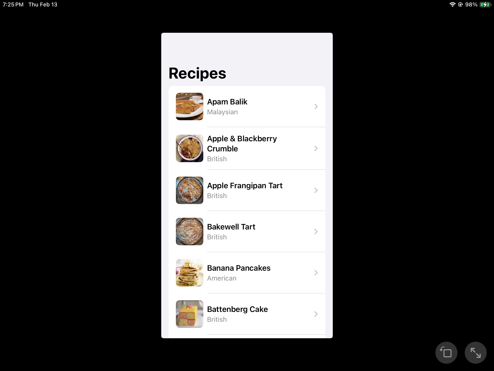
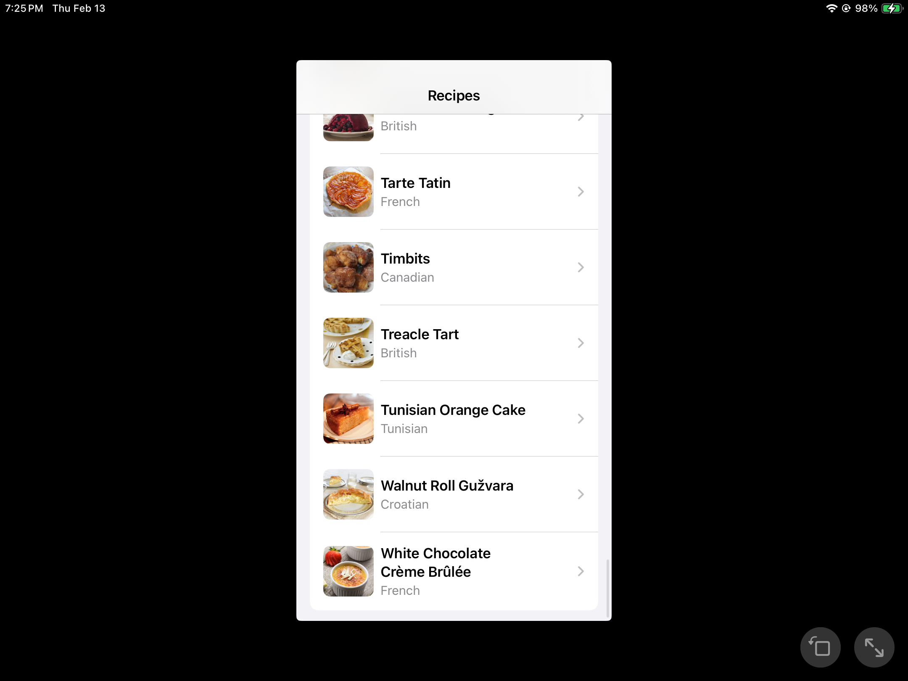
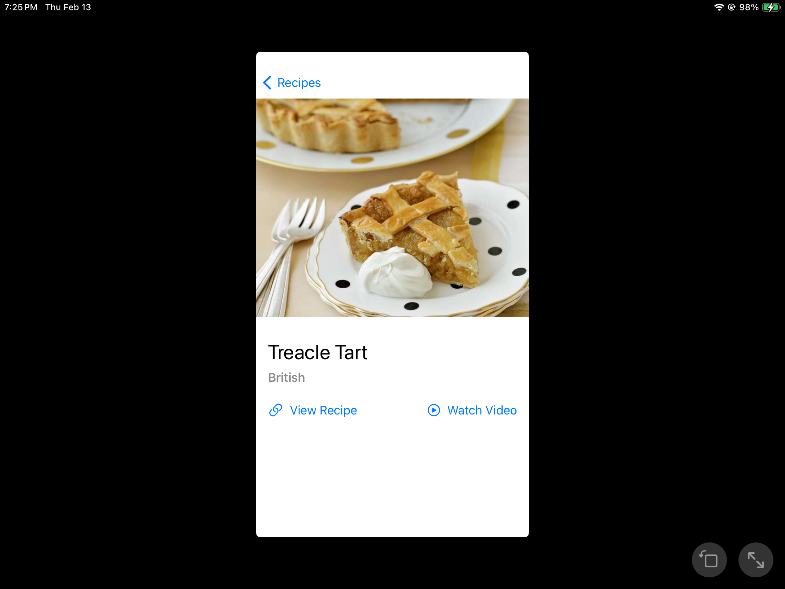

# RecipeApp

### Summary:
A modern iOS recipe management app built with SwiftUI that seamlessly integrates Cache system and async/await networking to provide a smooth, responsive recipe browsing experience. The app fetches and displays recipe data from a remote API, allowing users to explore, and interact with a comprehensive collection of culinary inspirations.

### Focus Areas:
1. Image Caching System
   - Implemented both memory and disk caching
   - Efficient image loading with lazy loading pattern
   - Cache invalidation and cleanup

2. Modern Concurrency
   - Leveraged async/await for clean asynchronous code
   - Proper actor isolation for thread safety
   - Efficient state management with MainActor

3. Testing
   - Comprehensive unit tests for core functionality
   - Mock network layer using URLProtocol
   - Test coverage for edge cases and error scenarios

4. User Experience
   - Pull-to-refresh functionality
   - Empty states and error handling
   - Smooth image loading transitions

### Time Spent:
- Total: ~11 hours
- Planning and Architecture: 2 hour
- Core Implementation: 5 hours
- Testing: 2 hours
- UI/UX Refinements: 2 hours

### Trade-offs and Decisions:
1. Used URLProtocol for network mocking instead of protocol-based dependency injection
   - Pros: Simpler implementation, works with URLSession
   - Cons: Less flexible for different networking implementations

2. Chose disk caching over Core Data
   - Pros: Simpler implementation, sufficient for image caching
   - Cons: Less powerful for complex data relationships

3. Used SwiftUI instead of UIKit
   - Pros: Rapid development, modern architecture
   - Cons: Less control over fine-grained UI customization

### Weakest Part of the Project:
The error handling could be more sophisticated:
- Error messages could be more user-friendly
- Retry mechanism for failed network requests
- Better handling of edge cases in image loading
- More granular error types for different failure scenarios

### Additional Information:
- Built with iOS 15+ to leverage async/await
- Used MVVM architecture for clean separation of concerns
- Implemented proper memory management to prevent leaks
- Focused on SwiftUI best practices and performance optimization
- All UI elements support both light and dark mode